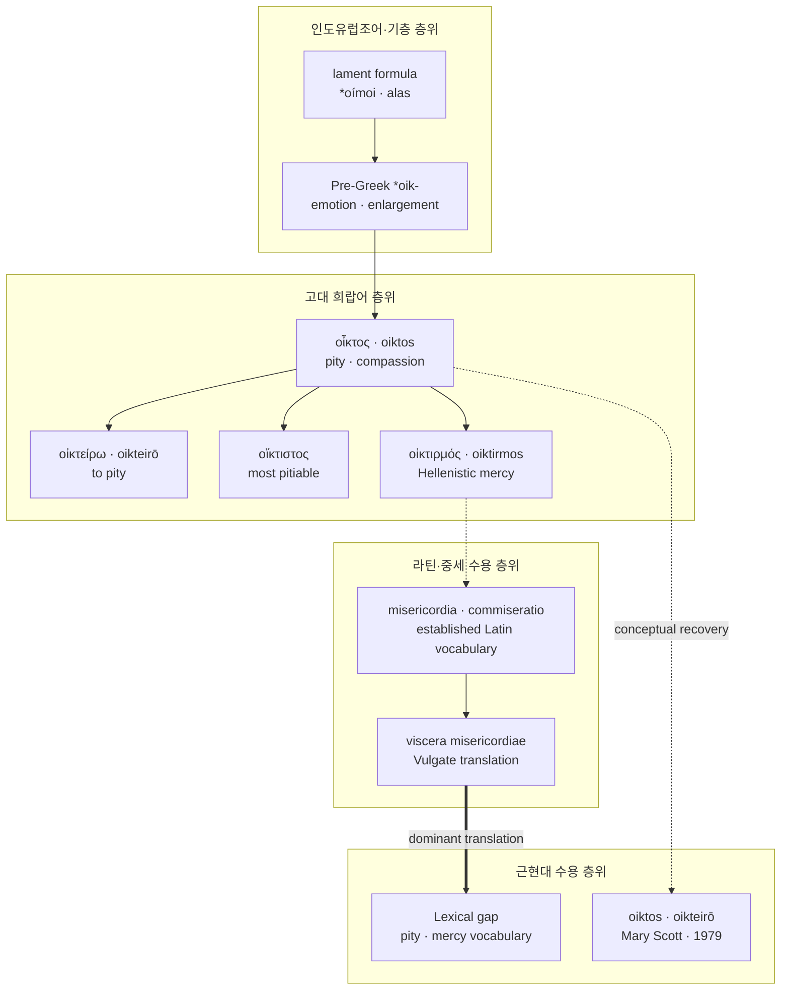

# Oiktos (오익토스)

**[[greek-reading-guide|읽는 법]]**: 오익토스 · **원어**: οἶκτος · **학술 전사**: *oîktos*

> **요약**: 고대 그리스어 **오익토스**(οἶκτος, *oîktos*, 감정적 위축과 가해 억제)와 동사 **오익테이로**(οἰκτείρω, *oikteírō*)는 비탄의 탄식 구호 οἴμοι에서 파생된 표현론적 의성어로, 서구 어휘 체계에서 라틴어 misericordia의 선점으로 인해 일상 차용어로 동화되지 못하고 어휘적 공백(Lexical Gap)을 남겼으나, 20세기 서양고전학 및 도덕심리학에서 번역 불가능한 고유 개념어(Scholarly Xenism)로 직수입되어 핵심 전문어로 수용되었습니다.

---

## 1. 어원 전파 및 차용 차단 계통도 (Etymological Transmission & Lexical Gap Tree)

---

## 2. 인구어(PIE) 및 희랍어 원어근 분석 (PIE & Proto-Greek Morphology)

> [!NOTE] 인도유럽조어(PIE) 공통 어근 부재 및 표현론적 의성어 판정
> 인도유럽비교언어학의 3대 공인 어원 사전인 베이케스(Robert Beekes 2010: 1063, *IE etymology: None*), 샹트렌(Pierre Chantraine, *DELG*, p. 788: *Sans étymologie*), 프리스크(Hjalmar Frisk, *GEW* 2.366: *Unetymologisiert*)는 모두 공통 인도유럽어(PIE) 어근 재구가 불가능하다고 판정합니다. 본 어휘군은 타인의 비참한 파멸을 목격할 때 본능적으로 터져 나오는 비탄의 외침 **οἴμοι**(*oímoi*, '아아, 슬프도다!')에 기반한 **표현론적 의성 조어**(Expressive onomatopoeic formation)입니다.

### 2.1 Schwyzer(1939: 722)의 의성 조어 형성 3단계

1. **기저 감탄사**: 극심한 고통이나 재앙에 직면했을 때 터져 나오는 원초적 비명 `*oi` (cf. `οἴ`, `οἴμοι` *oímoi*).
2. **연구개 확장음(Velar Enlargement)**: 감탄의 소리를 어휘적 어간으로 고정하기 위한 표현적 접미 확장음 `*-k-` 결합 → 원시 표현 어간 `*oik-` 형성.
3. **명사 및 형용사 접미 결합**:
   - 행위 추상명사 접미사 `*-to-` 결합: `*oik-` + `*-to-s` > **οἶκτος** (*oîktos*, 남성 명사: 원초적 의미 '탄식의 발화', '비탄').
   - 속성 형용사 접미사 `*-ro-` 결합: `*oik-` + `*-ró-s` > **οἰκτρός** (*oiktrós*, 남성 형용사: '탄식을 자아내는', '처참한'). (cf. αἶσχος -> αἰσχρός, ἔχθος -> ἐχθρός와 평행).

### 2.2 동사형 `οἰκτείρω`의 음운 천이와 아티케 금석학 표기

- **음운 변화 법칙**: 원시 그리스어 분모성(denominative) 접미사군 `*-er-yō`가 결합하여 반모음 `*y`의 모음간 전치(Epenthesis)와 이중모음화(Diphthongization)를 거쳤습니다:
  `*oikt-er-yō` > `*oikt-eyrō` > **οἰκτείρω** (*oikteírō*).
- **아티케 금석학 표준 표기 (-ει-)**: 기원전 5–4세기 아테네 비문(Threatte 1996: 642; Meisterhans 1900: 180)에서 동사 어간은 예외 없이 `<ΟΙΚΤΕΙΡ->` (`-ει-`)로 각자되어 있습니다.
- **비잔틴 사본의 이오타시즘(Iotacism) 비판**: 기원전 2세기 이후 코이네 그리스어에서 이중모음 `ει` [eː]가 단순 고모음 [i]로 단일모음화되면서 필사본에 `οἰκτίρω`로 오기되기 시작했습니다. 현대 비평본은 금석학 표준에 따라 **οἰκτείρω**를 정형으로 확정합니다.

### 2.3 핵심 어휘 4열 형태론 분리 표

| 그리스어 실제형 | 학술 전사 | 표제형·형태론 | 한국어 풀이 및 문헌학적 맥락 |
| :--- | :--- | :--- | :--- |
| **οἶκτος** | *oîktos* | 남성 명사 주격 단수 (o-어간) | 비탄, 비애, 연민. 『일리아스』에는 부재하며 『오뒷세이아』(2.81, 24.438)에 초출. |
| **οἰκτείρω** | *oikteírō* | 동사 현재 능동 직설법 1인칭 단수 | 가해를 멈추다, 조롱을 자제하다 (*oikt-er-yō 파생 정형). |
| **ᾤκτειρε** | *ṓikteire* | 동사 미완료 능동 직설법 3인칭 단수 | 가엾게 여겼다. 『일리아스』 23.534에서 에우멜로스를 향한 아킬레우스의 즉각적 제동. |
| **οἰκτείρεις** | *oikteíreis* | 동사 현재 능동 직설법 2인칭 단수 | 그대를 측은히 여긴다면. 『일리아스』 23.548 안틸로코스의 조건절 발화. |
| **οἰκτείρων** | *oikteírōn* | 동사 현재 능동 분사 남성 주격 단수 | 측은히 여기며. 『일리아스』 24.516 프리아모스를 손수 일으켜 세우는 동시적 태도. |
| **οἰκτρός** | *oiktrós* | 형용사 남성 주격 단수 (*-ro- 접미사) | 애처로운, 비참한. 탄식을 자아내는 물리적 상태. |
| **οἴκτιστον** | *oíktiston* | 형용사 최상급 중성 주격 단수 | 가장 비참한 (일). 『일리아스』 22.76 노인 시신 훼손을 가리키는 극단의 수치 상태어. |
| **οἰκτίστῳ** | *oiktístōi* | 형용사 최상급 남성 여격 단수 | 가장 비참한 (죽음으로). 『오뒷세이아』 11.412 아가멤논 암살 최후 규정어. |
| **οἰκτιρμός** | *oiktirmós* | 남성 명사 주격 단수 (코이네 파생) | 내장 깊은 긍휼. 호메로스에는 없으며 칠십인역/신약성서 핵심 신학 어휘. |

---

## 3. 호메로스 서사시 원전 용례 및 문헌학 (Homeric Epic Context & Philology)

호메로스 서사시에서 오익토스 어휘군은 관념적 명사가 아니라 구체적 행위이자 상태어로 작동합니다. 『일리아스』 전 24권 전체에서 명사 `οἶκτος`는 단 1회도 등장하지 않으며(0회), 오직 동사 `οἰκτείρω`(3회)와 최상급 형용사 `οἴκτιστον`(1회)만 출현합니다. 서사시 전체에서 명사 `οἶκτος`의 등장은 『오뒷세이아』(Od. 2.81, 24.438)에서 군중 전체를 연민이 사로잡는 대목의 집단 파토스 정형구 단 2회뿐입니다.

### 3.1 꼴찌로 전락한 귀족을 향한 가해 제동 (*Il.* 23.534–538, 548)

- **번역**: “발 빠른 고귀한 아킬레우스는 그를 보고 가엾게 여겼으며, 아르고스인들 가운데 서서 날개 돋친 말을 건넸다. ‘가장 뛰어난 사내가 꼴찌로 말을 몰고 왔구나! 그러니 자, 마땅하고 합당하게 그에게 2등상을 주도록 하자. [...]’ / [안틸로코스]: ‘하지만 만약 당신이 그를 가엾게 여기고 그가 당신의 마음에 든다면, 당신의 막사 안에 많은 금과 청동이 있으니...’”
- **원문**: *τὸν δὲ ἰδὼν ᾤκτειρε ποδάρκης δῖος Ἀχιλλεύς, / στὰς δ᾽ ἄρ᾽ ἐν Ἀργείοις ἔπεα πτερόεντ᾽ ἀγόρευε· / λοῖσθος ἀνὴρ ὥριστος ἐλαύνει μώνυχας ἵππους· / ἀλλ᾽ ἄγε δή οἱ δῶμεν ἀέθλιον, ὡς ἐπιεικές, / δεύτερ᾽· [...] / εἰ δέ μιν οἰκτείρεις καί τοι φίλος ἔπλε토 θυμῷ, / ἔστι τοι ἐν κλισίῃ χρυσὸς πολύς, ἔστι δὲ χαλκός,*
- **학술 전사**: *tòn dè idṑn ṓikteire podárkēs dîos Akhilleús, / stàs d’ ár’ en Argeíois épea pteróent’ agóreue; / loîsthos anḕr hṓristos elaúnei mṓnukhas híppous; / all’ áge dḗ hoi dō̂men aéthlion, hōs epieikés, / deúter’; [...] / ei dé min oikteíreis kaí toi phílos épleto thumō̂i, / ésti toi en klisíēi khrusòs polús, ésti dè khalkós,*
- **[주석]**: 미완료 동사 `ᾤκτειρε`(*ṓikteire*)와 현재 동사 `οἰκτείρεις`(*oikteíreis*). 결과주의 체제에서 패자가 겪는 공적 조롱을 차단하고 체면을 보전하는 즉각적 가해 제동 행위입니다. (상세 서사·제도 분석은 [[concept-oiktos#5.1 에우멜로스의 꼴찌 전락과 아킬레우스의 오익토스 (*Il.* 23.534–538, 548)|오익토스 개념 문서 5.1절]] 참조)

### 3.2 노인의 치욕적 시신 훼손에 대한 탄식 (*Il.* 22.71–76)

- **번역**: “그러나 개들이 죽임을 당한 노인의 센 머리와 센 턱수염과 치부(성기)를 더럽힐 때, 이것이야말로 가련한 필멸자들에게 가장 비참하고 수치스러운 일이다.”
- **원문**: *ἀλλ᾽ ὅτε δὴ πολιόν τε κάρη πολιόν τε γένειον / αἰδῶ τ᾽ αἰσχύνωσι κύνες κταμένοιο γέροντος, / τοῦτο δὴ οἴκτιστον πέλεται δειλοῖσι βροτοῖσιν.*
- **학술 전사**: *all’ hóte dḕ polión te kárē polión te géneion / aidō̂ t’ aiskhúnōsi kúnes ktaménoio gérontos, / toûto dḕ oíktiston péletai deiloîsi brotoîsin.*
- **[주석]**: 최상급 형용사 중성 주격 단수 `οἴκτιστον`(*oíktiston*). 신체 부위이자 수치 감정인 `αἰδώς`의 물리적 유린을 가리키는 극단의 수치 상태어입니다. (상세 서사 분석은 [[concept-oiktos#5.2 노인의 치욕적 시신 유린에 대한 탄식 (*Il.* 22.71–76)|오익토스 개념 문서 5.2절]] 참조)

### 3.3 엎드린 노왕을 손으로 일으켜 세움 (*Il.* 24.513–516)

- **번역**: “그는 곧바로 자리에서 일어나 손으로 노인을 일으켜 세웠으니, 센 머리와 센 턱수염을 가엾게 여겼던 것이다.”
- **원문**: *αὐτίκ᾽ ἀπὸ θρόνου ὦρτο, γέροντα δὲ χειρὸς ἀνίστη, / οἰκτείρων πολιόν τε κάρη πολιόν τε γένειον,*
- **학술 전사**: *autík’ apò thrónou ôrto, géronta dè kheiròs anístē, / oikteírōn polión te kárē polión te géneion,*
- **[주석]**: 현재 능동태 분사 `οἰκτείρων`(*oikteírōn*). 22.74행과 동일한 정형구("센 머리와 센 턱수염", *polión te kárē polión te géneion*)에 응답하며 엎드린 자의 존엄을 물리적으로 복원하는 신체적 행위입니다. (상세 서사 분석은 [[concept-oiktos#5.3 엎드린 프리아모스를 가엾게 여겨 손으로 일으킴 (*Il.* 24.513–516)|오익토스 개념 문서 5.3절]] 참조)

### 3.4 연회장 기습 살육과 가장 비참한 죽음 (*Od.* 11.409–412)

- **번역**: “아이기스토스는 내게 죽음과 파멸을 꾸며내어, 파멸적인 아내와 함께 나를 죽였소. 잔치에 초대하여 식사를 대접하듯, 여물통 곁에서 황소를 도륙하듯 말이오. 그렇게 나는 가장 비참한 죽음으로 죽어갔소.”
- **원문**: *ἀλλά μοι Αἴγισθος τεύξας θάνατόν τε μόρον τε / ἔκτα σὺν οὐλομένῃ ἀλόχῳ, οἶκόνδε καλέσσας, / δειπνίσσας, ὥς τίς τε κατέκτανε βοῦν ἐπὶ φάτνῃ. / ὣς θάνον οἰκτίστῳ θανάτῳ·*
- **학술 전사**: *allá moi Aígisthos teúksas thánatón te móron te / ékta sùn ouloménēi alókhōi, oîkónde kaléssas, / deipníssas, hṓs tís te katéktane boûn epì phátnēi. / hṑs thánon oiktístōi thanátōi;*
- **[주석]**: 최상급 형용사 남성 여격 단수 `οἰκτίστῳ`(*oiktístōi*). 환대([[concept-xenia|Xenia]])의 식탁 곁에서 가축처럼 도륙당하여 영웅적 명예를 송두리째 박탈당한 최악의 파멸을 규정합니다. (상세 분석은 [[concept-oiktos#3.3 『오뒷세이아』에서의 용례 맥락: 하데스 망령의 비탄과 생존자의 전율|오익토스 개념 문서 3.3절]] 참조)

---

## 4. 역사적 전파 및 수용사 경로 (Historical Transmission & Reception)

### 4.1 ἔλεος와 οἶκτος의 수용 분기: 제도화의 유무
- **ἔλεος의 제도적 사물화**: `ἔλεος`는 헬레니즘 코이네에서 2차 파생 명사 **ἐλεημοσύνη**(*eleēmosýnē*)를 거치며 '종교적 자선 제도'이자 '물질적 구제금/동전'으로 사물화(Reification)되었습니다. 로마 교회는 이를 디아코니아의 기술 용어인 **eleēmosyna**로 직수입했고, 이것이 고대 영어 `ælmesse`를 거쳐 현대 영어 **alms**, **almoner**, **eleemosynary**로 발전했습니다.
- **οἶκτος의 음차 부재**: 반면 `οἶκτος`는 물질적 화폐나 제도로 외화되지 않는 즉각적·내면적 가해 억제에 머물렀기에, 로마인들이 이를 음차 외래어(`*oictus`)로 수용할 사회적·실용적 유인이 전무했습니다.

### 4.2 라틴어 고유 심리어망의 어휘적 선점 (Semantic Preemption)
공화정 및 제정기 로마는 타인의 불행에 반응하는 고유 심리 어휘망을 이미 완벽하게 구축하고 있었습니다:
- **키케로 (Cicero, *Tusc. Disp.* 4.8.18)**: 스토아 정념론을 라틴어로 번역하며 *misericordia*를 "부당하게 고통받는 타인의 비참함으로 인해 일어나는 마음의 괴로움"으로 정의하여, 그리스어 *eleos*와 *oiktos* 일체를 라틴어 고유 복합어 **misericordia**(*miser* + *cor*)의 지배 하에 포섭했습니다.
- **세네카 (Seneca, *De Clem.* 2.4.4–2.5.1)**: 타인의 굴욕을 목격할 때 일어나는 감정적 동요를 "영혼의 결함이자 질병"인 *misericordia*로 규정하고 이성적 평정인 *clementia*로 통제하도록 요구했습니다.

### 4.3 칠십인역(LXX), 신약성서, 그리고 불가타(Vulgata)의 번역 흡수
- **히브리어 רַחֲמִים (raḥamîm) 번역**: 헬레니즘 코이네에서 형성된 명사 **οἰκτιρμός**(*oiktirmos*)는 칠십인역(LXX)과 신약성서(롬 12:1, 고후 1:3, 골 3:12)에서 모태/자궁(*reḥem*)에서 솟구치는 신의 내장 깊은 긍휼을 가리키는 전용 번역어로 채택되었습니다.
- **불가타(Vulgata)의 어휘적 흡수**: 히에로니무스는 이 어휘들을 음차하지 않고 고유 라틴어 **misericordia** 및 **viscera misericordiae**(자비로운 내장)로 완전 번역 흡수했습니다. 이로써 서구 중세 구어로의 음차 전파선이 영구 단절되었습니다.

### 4.4 20세기 고전문헌학의 학술 전문 외래어(Scholarly Xenism) 직수입
서구 일상어에 남겨진 어휘적 공백(Lexical Gap)과 기존 번역어(*pity*, *mercy*)의 치명적 왜곡을 극복하기 위해, 20세기 후반 고전문헌학계는 번역을 포기하고 **그리스어 원어를 이탤릭체 학술 전문어**로 직수입했습니다:
- **메리 스콧 (Mary Scott 1979)**: *eleos*(적극적 구호 전진 충동)와 *oiktos*(특수한 굴욕 앞에서의 소극적 조롱 억제)의 질적 분화를 최초 규명하고 고유 개념어 ***oiktos*** / ***oikteirein***을 확립.
- **더글러스 케언스 (Douglas Cairns 1993)**: 수치와 경외의 감정인 [[concept-aidos|아이도스]](*aidōs*)와 연동되어 시신 모독과 잔혹 행위를 차단하는 핵심 제동기로 규명.
- **버나드 윌리엄스 (Bernard Williams 1993)** & **그레이엄 잰커 (Graham Zanker 1994)**: 기성 영웅 규범을 초월하여 공통의 필멸성 앞에서 발휘되는 높은 차원의 도덕적 행위주체성(Moral Agency) 및 개인적 윤리(Personal Ethics)로 정초.

---

## 5. 음운 및 의미 변화사 (Phonological & Semantic Evolution)

### 5.1 음운 변천 단계
- **원초 단계**: 비탄 감탄사 `*oi` (신체적 비명)
- **어간 형성**: 연구개 확장음 `*-k-` 결합 → `*oik-`
- **어휘 파생**: 접미사 결합 → 남성 명사 `οἶκ-το-ς` (*oîktos*), 형용사 `οἰκ-τρό-ς` (*oiktrós*)
- **동사화**: `*oikt-er-yō` > `*oikt-eyrō` > `οἰκτείρω` (*oikteírō*, 반모음 전치 및 이중모음화)
- **헬레니즘 코이네**: 추상 명사 `οἰκτιρ-μό-ς` (*oiktirmos*)

### 5.2 역사적 의미 전이 5단계 사슬 (Semantic Shifts)

1. **신체적 음성 기호 (Acoustic / Somatic Interjection)**: `οἴμοι`(*oímoi*). 극심한 고통이나 재앙 앞에서 유기체에서 불수의적으로 터져 나오는 원초적 비명 소리.
2. **시각적 외화 및 오물화 (Visual Abjection & Externalization)**: `οἰκτρός` / `οἴκτιστον`. 비명을 자아내는 참상. 백발 노인의 성기 훼손(*Il.* 22.76)처럼 문명적 존엄이 파괴된 객관적 상태.
3. **상호주관적 가해 억제 (Intersubjective Behavioral Inhibition)**: `οἰκτείρω`. 타인의 굴욕 목격 시 승자의 가해와 조롱 충동을 멈추고 체면을 보전해 주는 도덕적 브레이크 (호메로스).
4. **비극적 실존 공포 (Existential Horror & Universalization)**: `οἶκτος δεινός` / `ἐποικτείρω`. 소포클레스 『필록테테스』(965행) 및 『아이아스』(121행). 타자의 비극 속에서 주체 자신의 취약성을 발견하는 보편적 전율.
5. **신학적 내장 자비 (Theological Visceral Compassion)**: `οἰκτιρμός`. 칠십인역 및 신약성서. 히브리어 *raḥamîm*과 결합하여 신의 창자가 끊어질 듯 요동치는 절대적 긍휼로 의미 재신체화.

---

## 6. 현대 영어 파생어군 및 어휘 패밀리 (Modern English Cognates & Derivatives)

> [!NOTE] 현대 영어 일반 사전(OED 등) 독립 표제어 미등재 현황
> `oiktos`는 현대 영어의 일반 어휘로 귀화되지 않았으며, OED Online 및 현대 일반 사전에 독립 표제어로 등재되어 있지 않습니다. 가짜 영단어(*\*oiktic*, *\*oiktism*) 날조를 엄격히 배제하며, 현대 고전문헌학·도덕철학·성서학 코퍼스에서 사용되는 **전문 학술 외래어**(Scholarly Xenisms)로 분류합니다.

### 6.1 현대 학술 코퍼스 실사용 전문 어휘 패밀리

| 표제형 (학술 차용어) | 희랍어 원어 | 학술 전사 | 문법 형태 | 현대 학술 코퍼스 용법 및 전문적 정의 | 대표 문헌 출전 및 코퍼스 근거 | 확실성 등급 |
| :--- | :--- | :--- | :--- | :--- | :--- | :--- |
| ***oiktos*** | οἶκτος | *oîktos* | 명사 (남성 단수) | **[고전문헌학·윤리학]** 타인의 극단적 굴욕 목격 시 일어나는 감정적 위축, 가해 자제, 비탄의 탄식 (*inhibition of triumph*) | Mary Scott (1979: 1–14); Cairns (1993: 115) | 정설/문헌 입증 |
| ***oikteiro*** (*oikteírein*) | οἰκτείρω | *oikteírō* | 동사 (현재 능동) | **[고전문헌학]** 타인의 처참한 수치 앞에서 가해를 멈추고 가엾게 여기다 (*to pity, check harm*) | *Il.* 23.534, 24.516; Scott (1979: 8) | 정설/문헌 입증 |
| ***oiktrós*** | οἰκτρός | *oiktrós* | 형용사 (남성 단수) | **[고전문헌학·비극론]** 비탄을 자아내는, 애처로운, 처참한 파멸에 처한 (*pitiable, lamentable*) | Dover (1974: 196); Sophocles, *Philoctetes* 965 | 정설/문헌 입증 |
| ***oíktistos*** | οἴκτιστος | *oíktistos* | 형용사 (최상급) | **[호메로스 시학]** 가장 비참한, 극도로 처참한 죽음이나 훼손 상태 (*most pitiable*) | *Od.* 11.412; *Il.* 22.76; Redfield (1975: 162) | 정설/문헌 입증 |
| ***oiktirmos*** (*oiktirmoí*) | οἰκτιρμός (οἰκτιρμοί) | *oiktirmós* (*oiktirmoí*) | 명사 (남성 단수/복수) | **[성서신학·칠십인역·신약]** 하나님의 애끓는 긍휼, 자비 (*mercies*; 히브리어 *raḥamim* 역어) | BDAG (2000: 696); Rom. 12:1; 2 Cor. 1:3 | 정설/문헌 입증 |
| ***splánkhna oiktirmoû*** | σπλάγχνα οἰκτιρμοῦ | *splánkhna oiktirmoû* | 명사구 (관사 생략) | **[신약 성서 주해]** 긍휼의 마음, 내장 깊은 곳에서 솟구치는 자비 (*bowels of mercies*) | Col. 3:12; BDAG (2000: 938) | 정설/문헌 입증 |

### 6.2 역대 영어 번역 대조 및 의미론적 결손(Semantic Loss) 분석

| 번역가 (출간 연도) | 주요 채택 번역어 | 번역사적 맥락 | 호메로스 *oiktos* 대비 의미론적 결손 |
| :--- | :--- | :--- | :--- |
| **조지 채프먼** (1611) | **ruth**, **pitie** | 자코비언 시대 고유 게르만계 어휘의 신체적 비탄 감각 활용 | *ruth*(고대영어 *hreow*)는 신체적 충격을 잘 담았으나 현대에 사어화됨. |
| **알렉산더 포프** (1720) | **pity**, **compassion** | 18세기 아우구스투스조 신고전주의 도덕감각론 투영 | 가해 자제의 팽팽한 긴장감을 귀족 신사의 온정주의로 미화함. |
| **리치먼드 래티모어** (1951) | **pity**, **take pity on** | 20세기 중반 엄격한 문헌학적 직역주의 | *eleos*(적극적 구호)와 *oiktos*(소극적 억제)의 구분을 무화시킴. |
| **로버트 페이글스** (1990) | **pity**, **grief** | 현대 영미 독자의 정서적 공감 극대화 | 귀족 사회의 체면 보전이라는 제도적 억제 기제를 내면 심리주의로 탈색함. |

- **영어 번역어의 3대 결손 메커니즘**:
  1. **pity (라틴어 *pietas* 유래)**: 중세 이후 우월한 자가 불행한 자를 내려다보는 시혜적 태도(**Condescension**)로 가치가 하락하여, 동등한 전사 간의 상호적 체면 보전 기능이 상실됨.
  2. **ruth (게르만 조어 *\*khrewō* 유래)**: 현대 영어에서 명사 *ruth*는 완전히 소멸하고 오직 부정 형용사 **ruthless**(무자비한)로만 화석화됨.
  3. **compassion (라틴어 *compassio* 유래)**: '고통의 내면적 분담'으로 고도화되었으나, *oiktos*의 본질인 가청적 탄식 소리(*oímoi*)와 장례적 애가의 신체 음성학적 차원이 탈락함.

---

## 7. 번역사적 한계와 가짜 동계어 주의 (Translation Disparity & False Cognates)

> [!WARNING] 민간 어원(Folk Etymology) 및 가짜 동계어 주의
> - **οἶκος (oîkos, 집/환경) 결부설 기각**: 과거 19세기 일각에서 주장된 "타인을 가족(oikos)처럼 여긴 데서 유래했다"는 설은 음운론적으로 완전한 허구입니다. οἶκος는 인도유럽조어 `*woyḱ-o-s`에서 유래하여 미케네 그리스어(*wo-ko*) 및 호메로스 서사시 전반에서 어두 디감마(*w- / ϝ*)를 보존합니다. 반면 호메로스 운율 스캔(*Il.* 23.534, 24.516)에서 *oiktos* 및 *oikteirō*는 디감마 흔적이 전무(0회)하므로, 현대 영어 *economy*, *ecology* 등과 어원적으로 완전히 무관합니다.
> - **라틴어 ictus (타격/일격)와의 무관성**: 라틴어 *ictus*는 동사 *īcō / īcere*(치다, PIE `*h₂eyg-`)에서 유래한 고유 라틴어 어휘로, 그리스어 *oiktos*와는 우연한 철자 유사성에 불과합니다.
> - **영어 pity 및 mercy와의 계보적 단절**: 영어 *pity*는 라틴어 *pietas*(경건), *mercy*는 라틴어 *merces*(대가, 보수)에서 유래한 로망스 어휘군으로, 그리스어 *oiktos*의 역사적 자손이 아닙니다.

---

## 8. 어원 증거 매트릭스 및 학술 출처 (Evidence Matrix & References)

| 번호 | 주장 및 분석 명제 | 문헌 및 사전 근거 | 언어 층위 | 확실성 등급 | 적용 섹션 |
|:---:|:---|:---|:---|:---:|:---:|
| 1 | **PIE 어근 부재 확정** | Beekes (2010: 1063), Chantraine (*DELG*: 788), Frisk (*GEW* 2: 366) | Indo-European | 정설/문헌 입증 | 2.1절 |
| 2 | **감탄사 οἴμοι 기반 의성 조어설** | Schwyzer (1939: 722), Chantraine (*DELG*: 788) | Ancient Greek | 학술적 재구 | 2.1절, 5.1절 |
| 3 | **아티케 비문 οἰκτείρω (-ει-) 정형** | Threatte (1996: 642), Meisterhans (1900: 180) | Attic Epigraphy | 정설/문헌 입증 | 2.2절 |
| 4 | **사본 이오타시즘 οἰκτίρω 오기 판정** | Threatte (1996: 642), NA28 비평 장치 | Koine / Byzantine | 정설/문헌 입증 | 2.2절 |
| 5 | 『**일리아스**』 **내 명사 οἶκτος 절대 부재** | 호메로스 서사시 텍스트 일람, LSJ s.v. οἶκτος | Epic Greek | 정설/문헌 입증 | 3절 서두 |
| 6 | 『**오뒷세이아**』 **명사 2회 초출**(Od. 2.81, 24.438) | Homer, *Od.* 2.81, 24.438; LSJ | Epic Greek | 정설/문헌 입증 | 3절 서두 |
| 7 | **에우멜로스 위로와 동사 ᾤκτειρε** | Homer, *Il.* 23.534–538, 548; Scott (1979: 7–8) | Epic Greek | 정설/문헌 입증 | 3.1절 |
| 8 | **노인 시신 훼손과 οἴκτιστον** | Homer, *Il.* 22.71–76; Cairns (1993: 75) | Epic Greek | 정설/문헌 입증 | 3.2절 |
| 9 | **프리아모스 부축 분사 οἰκτείρων** | Homer, *Il.* 24.513–516; Zanker (1994: 125) | Epic Greek | 정설/문헌 입증 | 3.3절 |
| 10 | **아가멤논 최후 οἰκτίστῳ θανάτῳ** | Homer, *Od.* 11.409–412; LSJ | Epic Greek | 정설/문헌 입증 | 3.4절 |
| 11 | **라틴어 어휘 선점 (misericordia)** | Cicero, *Tusc.* 4.8.18; Seneca, *Clem.* 2.4 | Classical Latin | 정설/문헌 입증 | 4.2절 |
| 12 | **LXX/신약 οἰκτιρμός 및 불가타 흡수** | LXX 시편 25:6; Rom 12:1; Col 3:12; BDAG (2000: 696) | Biblical Greek / Latin | 정설/문헌 입증 | 4.3절 |
| 13 | **현대 고전학 학술 전문어 직수입** | Mary Scott (1979), Cairns (1993), Williams (1993) | Modern English | 정설/문헌 입증 | 4.4절, 6.1절 |
| 14 | **οἶκος (PIE *woyḱ-o-s) 가짜 동계어 기각** | Beekes (2010: 1063), Chantraine (1968: 788) | Indo-European | 민간어원/허구 (Spurious) | 7절 |

---

## 관련 항목

- **호메로스 위키 연관 문서**:
  - [[concept-oiktos|오익토스 (Oiktos) 개념 문서]]
  - [[concept-eleos|엘레오스 (Eleos) 개념 문서]]
  - [[concept-aidos|아이도스 (Aidos) 개념 문서]]
  - [[entity-achilles|아킬레우스]]
  - [[entity-priam|프리아모스]]
- **동계어 및 어원 사전 문서**:
  - [[word-eleos|Eleos (엘레오스) 어원 사전]]
  - [[word-polytropos|Polytropos (폴뤼트로포스) 어원 사전]]
  - [[word-menis|Menis (메니스) 어원 사전]]
  - [[words/index|호메로스 어원·영단어 사전 인덱스]]
