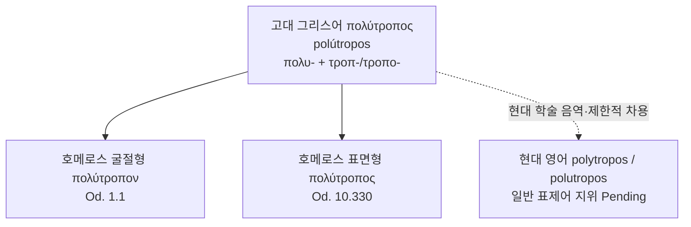

# Polytropos (폴리트로포스)

**[[greek-reading-guide|읽는 법]]**: 폴리트로포스 · **원어**: πολύτροπος · **학술 전사**: *polútropos*

> **요약**: `πολύτροπος`는 호메로스 그리스어에서 오디세우스를 수식하는 형용사로, 여러 방향으로 전환되고 많은 경험과 이동을 겪은 자라는 의미 영역을 연다. 현대 영어의 `polytropos`·`polutropos`는 일반 영어 표제어라기보다 고전학·문학비평에서 사용되는 학술적 음역 또는 제한적 차용형으로 다루며, 라틴어·프랑스어·중세 영어를 거친 직선적 전파 경로는 확인 전까지 보류한다.

---

## 1. 어원 전파 계통도 (Etymological Transmission Tree)

이 도식에서 실선은 고대 그리스어 표제형과 검증된 호메로스 굴절형의 관계를 나타낸다. 현대 영어 가지는 학술적 음역·사용 층위로 제한하며, `πολύτροπος`가 라틴어·프랑스어·중세 영어를 순차적으로 거친 상속어라는 뜻으로 읽어서는 안 된다. 독립 증거가 확보되지 않은 중간 언어 경로도 도식에는 넣지 않는다.

**혼동 방지**: 오디세우스와 『오뒷세이아』는 이 형용사가 호메로스에서 쓰이는 서사적 맥락이지, `πολύτροπος`의 어원 전파 계통은 아니다. 이름과 작품명의 독립 계통은 아래 3.3절 및 [[word-odyssey|Odyssey 어원·수용사]]에서 다룬다.

## 2. 인구어(PIE) 및 희랍어 원어근 분석 (PIE & Proto-Greek Morphology)

### 2.1 표제형과 구성 요소

고대 그리스어 사전의 표제형은 `πολύτροπος, -ον`이며, 일반적으로 `πολυ-`와 `τροπ-/τροπο-` 계열의 결합으로 분석된다. `πολυ-`는 `πολύς`의 복합어 요소로 “많은, 다수의”라는 의미를 제공하고, `τροπ-/τροπο-` 계열은 `τρόπος`, `τροπή`, `τρέπω`가 이루는 방향·전환·방식의 의미망과 연결된다.

| 구성 요소 또는 관계 | 그리스어 실제형 | 학술 전사 | 의미 및 근거 | 확실성 |
|:---|:---|:---|:---|:---|
| 접두 요소 | `πολυ-`; `πολύς` | *polu-*; *polús* | `πολύς`와 연결되는 복합어 요소. “많은, 여러”의 의미를 제공함 | 정설·문헌 입증 |
| 어근 계열 | `τροπ-/τροπο-`; `τρόπος`; `τροπή`; `τρέπω` | *trop-/tropo-*; *trópos*; *tropḗ*; *trépō* | 방식·방향·성격, 전환, 돌림·방향 전환과 연결되는 어휘군 | 정설·문헌 입증 |
| 전체 표제형 | `πολύτροπος` | *polútropos* | “여러 방식으로 전환된/전환하는” 의미 영역을 여는 복합 형용사 | 문헌 입증 및 해석적 세분화 |
| 별개 어휘 | `μορφή` | *morphḗ* | “형태·형상”을 뜻하는 별개의 여성 명사. `πολύτροπος`의 구성 요소나 중간 어형이 아님 | 정설·문헌 입증 |
| 확정된 단일 PIE 원형 | — | — | `πολύτροπος` 전체에 대해 현재 자료만으로 확정할 수 없음 | 근거 부족·추가 조사 필요 |

`μορφή`는 “형태론”이라는 현대 한국어 메타언어와 혼동하기 쉬우나, 고대 그리스어 어휘로서 `πολύτροπος`의 구성에 들어가지 않는다. 따라서 이 문서는 `μορφή`를 어원 계통도에 넣지 않고, 형태론적 분석과 별개의 어휘라는 주석으로만 다룬다. [LSJ/Cunliffe `μορφή`](https://atlas.perseus.tufts.edu/dictionaries/headword/%CE%BC%CE%BF%CF%81%CF%86%CE%AE/)

`τρέπω`·`τροπή`·`τρόπος`의 사전적 관계는 `πολύτροπος`의 의미 배경을 설명하는 데 유효하지만, 이것만으로 `-τροπος`를 `τρέπω`의 수동분사형이라고 분석할 수는 없다. 또한 바후브리히 복합어라는 분류가 제안되더라도, 그 형태만으로 “스스로 여러 방향으로 움직이는 자”와 “외부 힘에 의해 여러 방향으로 전환된 자”라는 두 사전적 정의를 확정해서는 안 된다.

> [!NOTE] PIE 재구 보류
> `πολύτροπος` 전체에 확정된 PIE 조어형을 부여하지 않는다. `πολύς`와 `τρέπω` 각각의 비교언어학적 어원은 이 표제어 전체의 PIE 재구와 별도의 문제이며, 공인 사전의 직접 근거가 확보될 때까지 `Uncertain / Pending`으로 둔다.

주요 사전 근거는 [LSJ `πολύτροπος`](https://atlas.perseus.tufts.edu/dictionaries/entry/urn:cite2:scaife-viewer:dictionaries.v1:lsj-n85454/), [Cunliffe `πολύτροπος`](https://atlas.perseus.tufts.edu/dictionaries/entry/urn:cite2:scaife-viewer:dictionaries.v1:cunliffe_lex-n7940/), [LSJ `τρόπος`](https://atlas.perseus.tufts.edu/dictionaries/entry/urn:cite2:scaife-viewer:dictionaries.v1:lsj-n105531/), [LSJ `τροπή`](https://atlas.perseus.tufts.edu/dictionaries/entry/urn:cite2:scaife-viewer:dictionaries.v1:lsj-n105517/), [LSJ `τρέπω`](https://atlas.perseus.tufts.edu/dictionaries/entry/urn:cite2:scaife-viewer:dictionaries.v1:lsj-n104685/)이다.

## 3. 호메로스 서사시 원전 용례 및 인명학 (Homeric Epic Context & Onomastics)

### 3.1 _Od._ 1.1의 `πολύτροπον`

표준 Scaife/Perseus 본문에서 『오뒷세이아』 첫 행의 표면형은 표제형 `πολύτροπος`가 아니라 `πολύτροπον`이다. 이는 `ἄνδρα`와 일치하는 남성 대격 단수 형용사로, 이름이 먼저 나오지 않은 상태에서 주인공을 수식한다.

- **번역**: “말해다오, 무사여, 여러 길을 겪은 그 사람을.”
- **원문**: *ἄνδρα μοι ἔννεπε, μοῦσα, πολύτροπον*
- **학술 전사**: *ándra moi énnepe, moûsa, polútropon* (_Od._ 1.1)
- **번역**: “그는 많은 도시와 사람들의 마음을 보며 크게 방랑했다.”
- **원문**: *ὃς μάλα πολλὰ πλάγχθη*
- **학술 전사**: *hòs mála pollà plágkhthē* (_Od._ 1.2)
- 출전: [Scaife Digital Library, _Od._ 1.1–1.6](https://atlas.perseus.tufts.edu/library/passage/urn:cts:greekLit:tlg0012.tlg002.perseus-grc2:1.1-1.6/)

1.1–5행은 많은 도시와 사람을 보고, 바다에서 고통을 겪고, 동료들의 귀환을 지키지 못한 인물을 함께 제시한다. 그러므로 이 자리의 의미 영역은 “교활한 사람” 하나로 닫기보다, 많은 이동·전환·경험을 겪은 사람이라는 사전적·문맥적 가능성을 열어 두어야 한다. 정확히 10년의 방랑이 첫 행에 직접 명시된다는 주장도 이 문서에서는 채택하지 않는다.

### 3.2 _Od._ 10.330의 `πολύτροπος`

『오뒷세이아』 10.330에서는 `πολύτροπος`가 `Ὀδυσσεύς`와 직접 결합한다.

- **번역**: “아, 그대가 바로 여러 길을 겪은 오디세우스구나.”
- **원문**: *ἦ σύ γʼ Ὀδυσσεύς ἐσσι πολύτροπος*
- **학술 전사**: *ē̂ sú g’ Odusseús essi polútropos* (_Od._ 10.330)
- 출전: [Scaife Digital Library, _Od._ 10.330](https://atlas.perseus.tufts.edu/library/passage/urn:cts:greekLit:tlg0012.tlg002.perseus-grc2:10.330/)

이 행의 발화자는 헤르메스가 아니라 키르케이다. 헤르메스는 오디세우스의 도착을 미리 예고한 인물로 키르케의 말 속에 등장하므로, 이 용례는 오디세우스와 헤르메스 사이의 지략·전환·변신 능력을 연결하는 시적 연상망을 만들 수 있다. 그러나 그 연상은 원전 배열과 비교 해석에서 나오는 것이며, `πολύτροπος` 자체의 사전적 정의로 환원해서는 안 된다.

### 3.3 수식어와 이름의 구별

`πολύτροπος`는 `Ὀδυσσεύς`의 역사적 어원이 아니라 오디세우스를 묘사하는 수식어다. 『오뒷세이아』 첫머리의 형용사는 이름이 제시되기 전 주인공의 서사적 성격과 경험을 열어 놓으며, 이 관계를 이름의 어원으로 설명하지 않는다. 오디세우스 이름과 `Ὀδύσσεια`·`Odyssey`의 수용사는 별도의 인명·작품명 계통으로 정리한다.

후대 이문 또는 주석 전승에서 논의되는 `πολύκροτον`은 표준 본문에 채택된 `πολύτροπον`과 섞지 않는다. 실제 사본 독법인지 후대의 주석적 변형인지가 별도로 확정되기 전까지는 본문 용례 수에 포함하지 않고 보류 항목으로 둔다.

## 4. 역사적 전파 및 수용사 경로 (Historical Transmission & Reception)

### 4.1 고대 그리스어 내부의 의미 확장

`πολύτροπος` 계열은 호메로스의 시적 수식어에 머물지 않고 후대 문헌에서 “여러 방식으로”, “변통성 있는”, “교활한”, “다양한” 방향으로 의미가 확장된다. LSJ는 호메로스 용례와 고전기·후대 용례를 구분해 제시하며, 투퀴디데스의 굴절형과 히브리서 1.1의 부사형을 의미 확장의 사례로 묶는다.

이 확장은 일반화와 은유화가 결합한 것으로 볼 수 있다. 물리적 방향 전환과 이동의 어휘가 사람의 판단·행동·말하기 방식으로 확장되지만, 각 문헌의 맥락을 동일한 단일 의미로 합쳐서는 안 된다.

### 4.2 고대 수용의 분기

『헤르메스 찬가』의 `παῖδα πολύτροπον` 4.13과 `πολύτροπε` 4.439는 이 형용사가 오디세우스에게만 독점된 이름이 아님을 보여 준다. 플라톤의 『소 히피아스』에서는 `πολύτροπος`가 거짓말·지식·능력의 문제로 재배치되고, 안티스테네스 전승에서는 청중과 상황에 맞추어 말을 바꾸는 적응성의 문제로 긍정적으로 재해석된다.

플라톤의 논의를 오디세우스에 대한 단순한 지적 찬양으로 정리하지 않으며, 안티스테네스의 입장도 포르피리오스가 보존한 후대 단편 전승이라는 한계를 명시한다. 이 철학적·문학적 수용의 상세 논의는 기존 폴리트로포스 추가 연구 문서에서 다룬다.

### 4.3 라틴어·프랑스어·중세 영어 경로의 보류

`πολύτροπος → Latin polytropus → 고대 프랑스어 → 중세 영어 → 현대 영어 polytropos`라는 연속 경로는 현재 확인된 자료만으로 입증되지 않는다. 템플릿의 기본 전파 배열은 모든 표제어에 적용하는 사실 경로가 아니라 예시이므로, 이 문서에서는 라틴어·고대 프랑스어·중세 영어 단계를 `transmissions`에 넣지 않는다.

라틴어 `Ulixes/Ulysses`, 프랑스어 `odyssée`, 영어 `Odyssey/odyssey`는 오디세우스 이름과 작품명에 속한 별도 평행 계통이다. 이들은 `πολύτροπος`의 직접 파생어 또는 중간 단계가 아니다.

## 5. 음운 및 의미 변화사 (Phonological & Semantic Evolution)

### 5.1 음운 및 철자 변천

고대 그리스어 표제형은 `πολύτροπος`이며, _Od._ 1.1에서는 문법적 일치에 따라 `πολύτροπον`으로 굴절한다. 현대 학술 표기에서는 `polytropos`와 `polutropos`가 모두 나타날 수 있으나, 둘 중 하나를 현대 영어의 유일한 표준 표제어로 확정하지 않는다.

`polytropos`의 현대적 표기는 고대 그리스어 원형의 로마자 전사·학술적 차용으로 다루며, 라틴어·프랑스어·중세 영어의 연쇄적 음운 변화를 거친 상속어로 기술하지 않는다. 중간 언어의 실제 철자형과 연대가 확인되면 별도 갱신 대상으로 남긴다.

### 5.2 역사적 의미 전이

| 시기·층위 | 의미 영역 | 의미 변화 메커니즘 | 확실성 |
|:---|:---|:---|:---|
| 호메로스 | 많은 방향으로 전환된, 많은 이동과 경험을 겪은 | 이동·방향의 구체적 의미 | 정설·문헌 입증 |
| 고전기·후대 그리스어 | 여러 방식으로 움직이는, 변통성 있는, 교활한, 다양한 | 구체적 방향에서 행위·판단 방식으로 은유적 확장 | 정설·문헌 입증 |
| 플라톤적 수용 | 거짓말·지식·능력의 역설과 연결된 인물형 | 윤리·인식론적 추상화 | 논쟁적·이설 대립 |
| 안티스테네스 전승 | 청중과 상황에 맞춰 말을 바꾸는 적응성 | 수사학적 재해석 | 논쟁적·이설 대립 |
| 현대 영어 번역 | many ways, many devices, twists and turns, complicated | 번역자의 의미 선택과 압축 | 문헌 입증, 해석은 분화 |

“교활한”은 후대의 비유적 의미와 일부 번역이 강조하는 층위이지, 호메로스 첫 행의 유일한 정의가 아니다. “능동적으로 여러 방향으로 움직이는 자”와 “바다·운명·포세이돈에 의해 여러 방향으로 흔들린 자”의 양면성도 형태론만으로 확정되는 두 뜻이 아니라, _Od._ 1.1–5의 문맥과 후대 해석이 결합한 강한 추론으로 표시한다.

주요 현대 번역은 서로 다른 의미 층위를 선택한다. Murray는 “many devices”, Lattimore는 “many ways”, Fagles는 “twists and turns”, Wilson은 “a complicated man”으로 옮긴다. 이 표현들은 서로 다른 번역 수용 사례이며, `πολύτροπος`에서 역사적으로 파생된 영어 동계어 목록이 아니다.

## 6. 현대 영어 파생어군 및 어휘 패밀리 (Modern English Cognates & Derivatives)

현대 영어에서 확인되는 형식은 하나의 어휘 패밀리로 자동 묶지 않는다. 특히 `polytropic`은 독립적인 과학·기술 형용사로 사용되므로, 호메로스적 `πολύτροπος`의 문학적 의미가 그대로 이어졌다고 단정할 수 없다.

| 품사·형태 | 단어 | 의미 및 용법 | 최초 기록 | 확실성 |
|:---|:---|:---|:---|:---|
| 학술 음역 | *polytropos* | 고대 그리스어 `πολύτροπος`의 라틴 문자 표기 및 제한적 학술 사용 | 정확한 영어 최초 기록 확인 보류 | 정설·문헌 입증, 일반 표제어 지위는 Pending |
| 학술 음역 변이 | *polutropos* | 모음 표기의 변이를 반영하는 학술적 표기 | 정확한 최초 기록 확인 보류 | 정설·문헌 입증, 일반 표제어 지위는 Pending |
| 형용사·생물학 | *polytropic* | 여러 종류의 꽃을 방문하는 곤충에 관한 현대 과학어 | 사전 등재 확인, OED 최초 기록은 별도 확인 필요 | 독립 영어 표제어로 Established, `πολύτροπος` 직계 파생은 Pending |
| 형용사·학술어 후보 | *polytropous* | 고전학·기술 문맥에서 나타날 수 있는 형식이나 언어·시대·품사 구분 필요 | 확인 보류 | 근거 부족·추가 조사 필요 |
| 명사·현대 분석어 후보 | *polytropism* | 다중 전환·다방향성을 설명하는 현대 비평적 분석어 후보 | 독립 사전·최초 기록 확인 보류 | 근거 부족·추가 조사 필요 |
| 번역어 | *many-sided*, *versatile*, *wily* | `πολύτροπος`의 의미 층위를 영어로 옮기는 선택 | 해당 번역의 출판 기록 | 번역 수용, 동계어 아님 |
| 번역어 | *complicated* | Wilson의 현대적 번역 선택 | 해당 번역의 출판·해설 기록 | 번역 수용, 직접 어원 아님 |

`polytropic`은 [Merriam-Webster 표제어](https://www.merriam-webster.com/dictionary/polytropic)에서 현대 영어의 별도 기술어로 확인되지만, `poly- + -tropic`이라는 현대적 형태소 분석과 호메로스 형용사의 문학적 수용은 구분해야 한다. `polytropous`, `polytropism`, `polytropy`, `polytropically`는 독립된 사전·코퍼스 증거가 확보될 때까지 확정 파생어 목록에 넣지 않는다.

`Odyssey`, `odyssey`, `Odyssean`, `Ulysses`는 이 표제어의 어휘 패밀리가 아니다. 이들은 오디세우스의 이름과 작품명에서 나온 별도 문서인 `word-odyssey.md`의 영역이다.

> [!WARNING] 가짜 동계어 및 과잉 연결 주의
> `polytropos`를 `polytropic`, `polytropous`, `complicated`, `Odyssey`, `Ulysses`의 직접적인 역사적 파생어로 묶지 않는다. 표면적 형태 유사성, 번역 대응, 별도 어원 계통을 구분한다.

## 7. 인명·신명 파생 고유명사 및 관용표현 (Eponymous Terms & Cultural Idioms)

`πολύτροπος`는 인명에서 파생된 eponym이 아니다. 오디세우스에게 붙은 형용사라는 점은 분명하지만, `Ὀδυσσεύς`라는 고유명사에서 만들어진 단어가 아니며 오디세우스 이름의 어원을 설명하지도 않는다. 따라서 이 문서는 `word_type: concept`로 분류하고, 인명 파생 관용구를 별도 어원 패밀리로 만들지 않는다.

### 7.1 현대 번역 수용

Wilson의 “complicated”는 `πολύτροπος`의 다층성을 현대 영어의 인격 형용사로 압축한 번역 선택이다. Wilson의 설명은 “many turned”라는 문자적 배경, 오디세우스가 겪은 전환과 스스로 수행하는 전환, 운율과 현대 영어의 즉각성을 함께 고려한 번역론적 설명이다. 이는 `complicare`에서 `πολύτροπος`로 이어지는 직접 어원 경로가 아니다. [Columbia University의 Wilson 번역 소개](https://news.columbia.edu/news/epic-new-journey-odyssey), [Wilson의 번역 선택 해설](https://emily613.substack.com/p/on-complicated)

Murray, Lattimore, Fitzgerald, Fagles와 한국어 번역자들의 표현 차이는 `πολύτροπος`의 어느 층위를 보존하는지 보여 주는 현대 수용 자료다. “devices”는 기지와 수단, “ways”는 방식과 길, “twists and turns”는 이동과 굴절, “complicated”는 복합적 인격을 전면화한다. 이 번역사는 단일 정답을 정하는 목록이 아니라 의미 선택의 역사로 기록한다.

### 7.2 현대 비평 용어

Pucci의 *Odysseus Polutropos*와 일부 연구에서의 `polytropism`은 `πολύτροπος`를 오디세우스의 다중적 서사·자기 재구성·상호텍스트성으로 확장하는 현대 비평의 표제와 분석 도구다. 그러나 이것을 고대 그리스어의 고정된 전문어 대립, 특히 `monotropism`과의 고대 개념쌍으로 소급하지 않는다.

> [!WARNING] 번역어와 어원을 혼동하지 않기
> 현대 번역자가 선택한 영어 형용사는 고대 그리스어 표제어의 역사적 파생어가 아니다. 번역 수용, 학술적 음역, 현대 영어의 독립적인 기술어를 각각 별도의 층위로 기록한다.

## 8. 어원 증거 매트릭스 및 학술 출처 (Evidence Matrix & References)

| 어원 및 수용 명제 | 언어 층위 | 확실성 등급 | 출전 및 학술 문헌 근거 |
|:---|:---|:---|:---|
| 사전 표제형은 `πολύτροπος, -ον`이다 | 고대 그리스어 형태론 | 정설·문헌 입증 | [LSJ `πολύτροπος`](https://atlas.perseus.tufts.edu/dictionaries/entry/urn:cite2:scaife-viewer:dictionaries.v1:lsj-n85454/); [Cunliffe `πολύτροπος`](https://atlas.perseus.tufts.edu/dictionaries/entry/urn:cite2:scaife-viewer:dictionaries.v1:cunliffe_lex-n7940/) |
| `πολύτροπος`는 `πολυ-`와 `τροπ-/τροπο-` 계열의 의미망을 가진다 | 고대 그리스어 복합어·어휘론 | 정설·문헌 입증 | LSJ `πολύς`, `τρόπος`, `τροπή`, `τρέπω`; Cunliffe `πολύτροπος` |
| `μορφή`는 `πολύτροπος`와 무관한 별도 명사다 | 고대 그리스어 어휘론 | 정설·문헌 입증 | [LSJ/Cunliffe `μορφή`](https://atlas.perseus.tufts.edu/dictionaries/headword/%CE%BC%CE%BF%CF%81%CF%86%CE%AE/) |
| `πολύτροπος` 전체의 확정된 PIE 원형은 현재 자료로 지정할 수 없다 | 비교언어학·PIE | 근거 부족·추가 조사 필요 | `pie_root: Uncertain / Pending`; 공인 비교어원 사전의 직접 확인 전 재구 보류 |
| _Od._ 1.1의 형태는 `πολύτροπον`이며 `ἄνδρα`와 일치한다 | 호메로스 그리스어 | 정설·문헌 입증 | [Scaife _Od._ 1.1–1.6](https://atlas.perseus.tufts.edu/library/passage/urn:cts:greekLit:tlg0012.tlg002.perseus-grc2:1.1-1.6/); LSJ |
| _Od._ 10.330의 형태는 `πολύτροπος`이며 `Ὀδυσσεύς`와 결합한다 | 호메로스 그리스어 | 정설·문헌 입증 | [Scaife _Od._ 10.330](https://atlas.perseus.tufts.edu/library/passage/urn:cts:greekLit:tlg0012.tlg002.perseus-grc2:10.330/); LSJ |
| 호메로스 문맥의 기본 의미 영역은 이동·전환·방랑이다 | 호메로스 의미론 | 정설·문헌 입증 | LSJ `πολύτροπος`; _Od._ 1.1–5; 기존 추가 연구 |
| “교활한”을 유일한 정의로 고정하지 않는다 | 번역·의미론 | 정설·문헌 입증 | LSJ의 복수 의미군; 현대 번역 비교 |
| 능동적 전환과 피동적 전환의 양면성은 형태론의 자동적 결과가 아니다 | 고대 그리스어 해석론 | 논쟁적·이설 대립 | _Od._ 1.1–5의 문맥; 기존 추가 연구의 해석 정리 |
| `πολύτροπος`가 `Ὀδυσσεύς`의 역사적 어원이라는 주장은 성립하지 않는다 | 인명학 | 민간어원·허구 | `word-odyssey.md`; 형용사와 고유명사의 문헌적 구별 |
| 후대 그리스어에서 “여러 방식으로·변통성 있게”라는 의미 확장이 나타난다 | 고전기·코이네 그리스어 | 정설·문헌 입증 | LSJ `πολύτροπος`; 투퀴디데스·히브리서 인용군 |
| 플라톤의 수용은 거짓말·지식·능력의 문제로 의미를 재배치한다 | 고전기 철학 | 논쟁적·이설 대립 | 플라톤, _Hippias Minor_ 364e–365b; 기존 추가 연구 |
| 안티스테네스의 긍정적 재해석은 후대 단편 전승에 의존한다 | 후대 철학 수용 | 논쟁적·이설 대립 | 포르피리오스 보존 단편 및 현대 단편 연구 |
| `polytropos`·`polutropos`는 현대 학술 음역으로 사용될 수 있다 | 현대 학술 영어 | 정설·문헌 입증, 일반 표제어 지위는 Pending | Pucci 표기; 기존 연구 자료; 정확한 영어 최초 기록은 별도 확인 필요 |
| `polytropic`은 현대 영어의 독립 기술어지만 `πολύτροπος`의 직계 파생어로 확정할 수 없다 | 현대 영어 과학어휘 | 논쟁적·이설 대립 | [Merriam-Webster `polytropic`](https://www.merriam-webster.com/dictionary/polytropic) |
| `polytropous`, `polytropism`, `polytropy`의 표제어·계보는 추가 조사가 필요하다 | 현대 영어·비평어 | 근거 부족·추가 조사 필요 | 독립 사전·코퍼스·최초 기록 확인 전 보류 |
| Wilson의 `complicated`는 번역 선택이지 `polytropos`의 직접 어원이 아니다 | 현대 영어 번역 수용 | 민간어원·허구 | [Columbia University](https://news.columbia.edu/news/epic-new-journey-odyssey); [Wilson 해설](https://emily613.substack.com/p/on-complicated) |
| 라틴어·프랑스어·중세영어를 거친 직선적 전파 경로는 현재 입증되지 않았다 | 차용사 | 근거 부족·추가 조사 필요 | `transmissions`를 `[greek, modern_english]`로 제한; 중간 단계 독립 증거 필요 |
| `Odyssey`, `odyssée`, `Ulixes/Ulysses`는 별도의 작품명·인명 계통이다 | 라틴어·프랑스어·현대 영어 | 정설·문헌 입증 | `word-odyssey.md`; Lewis–Short 및 프랑스어 사전 자료 |
| `polytropism`·`monotropism`을 고대의 고정 전문어 대립으로 소급하지 않는다 | 현대 비평 용어 | 민간어원·허구 | 기존 raw 자료와 추가 연구의 주장 감사 |

> [!WARNING] 민간 어원 및 과잉 수용 경로 주의
> `πολύτροπος`를 `Ὀδυσσεύς`, `Odyssey`, `Ulysses`, `polytropic`, `complicated`의 직접 역사적 어원으로 연결하지 않는다. 원어 형태, 번역어, 현대 학술 음역, 별도 영어 기술어를 구분한다.

> [!NOTE] 문서 상태
> PIE 전체형, 현대 영어 일반 표제어 지위, 중간 언어의 실제 전파 경로, 일부 현대 파생형의 독립 어휘 지위가 확정되지 않았으므로 `status: review`를 유지한다.

## 관련 항목

- [[analysis-polytropos|폴리트로포스 추가 연구]]
- [[raw-2026-polytropos-notes|Raw 추가 자료 — 폴리트로포스의 다층적 의미와 수용사 연구]]
- [[entity-odysseus|오디세우스]]
- [[word-odyssey|Odyssey 어원·수용사]]
- [[words/index|호메로스 어원·영단어 사전 인덱스]]
