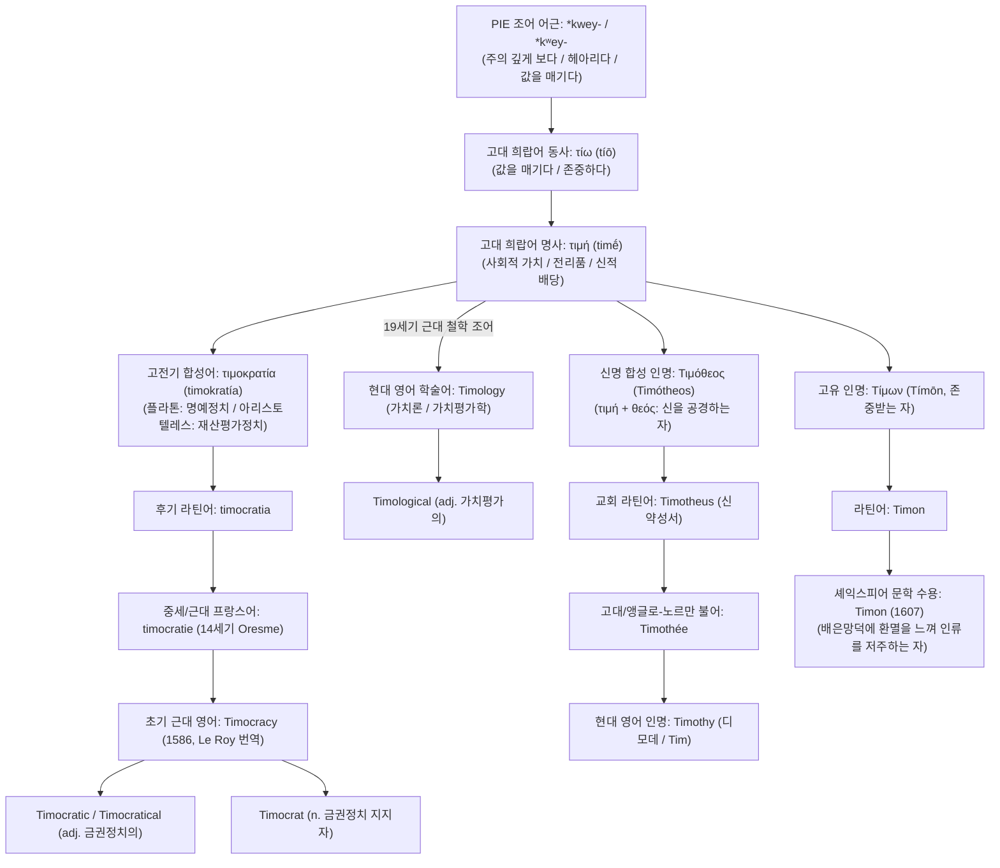

# Time (티메)

**[[greek-reading-guide|읽는 법]]**: 티메 · **원어**: τιμή · **학술 전사**: *timḗ*

> **요약**: 고대 그리스어 **티메**(τιμή, *timḗ*, 가치·명예·신적 배당)와 동사 **티오**(τίω, *tíō*, 값을 매기다·존중하다)는 대상을 헤아리고 평가하는 인도유럽조어 어근 *kwey-*에서 기원하여, 고전기 정치철학의 헌정 체제 개념인 **Timocracy**(금권정치/명예정치, 1586년 영어 정착)와 19세기 가치평가학 **Timology**, 그리고 성서적 인명 **Timothy**(디모데) 및 셰익스피어 희곡을 통한 인간혐오자의 대명사 **Timon**으로 현대 영어에 수용되었습니다.

---

## 1. 어원 전파 계통도 (Etymological Transmission Tree)

---

## 2. 인구어(PIE) 및 희랍어 원어근 분석 (PIE & Proto-Greek Morphology)

- **PIE 조어 어근**: `*kwey-` 또는 `*kʷey-` (원초적 의미: 주의 깊게 바라보다, 헤아려 값을 매기다, 보상·배상하다)
- **비교언어학적 음운 변화 및 동계어**:
  - 인구어 조어의 양순연구개음 `*kʷ`는 고대 희랍어에서 전설모음(ι, ε) 앞에서 치음 **τ(t)**로 전이되었습니다 (`*kʷi-` → `τι-`).
  - **슬라브어군 동계어**: 고대 교회 슬라브어 *čajati*(기대하다, 바라다), *čisti*(세다, 존중하다), 러시아어 *čest’*(честь, 명예), *čitat’*(читать, 읽다, 셈하다).
  - **인도-이란어군 동계어**: 산스크리트어 *cáyati*(존중하다, 처벌하다), *citi*(이해, 사유), 아베스타어 *cayeiti*(속죄하다).
- **고대 희랍어 형태론 구조**:
  - 동사 어근 `τι-`에 명사 형성 접미사 `-μα` / `-μη`가 결합하여 추상 명사 **τιμή**(*timḗ*)를 형성했습니다.
  - 부정 접두사 `ἀ-`(alpha privative)가 결합하여 **ἄτιμος**(*átimos*, 권리·티메를 박탈당한 자) 및 동사 **ἀτιμάω**(*atimáō*, 자리를 빼앗다, 모욕하다)를 파생시켰습니다.

> [!WARNING] 민간 어원(Folk Etymology) 및 동음이의어 주의
> 영어 단어 time(시간, 세월)은 고대 영어 tīma(시간, 기간), 원시 게르만어 *tīmô 및 인도유럽조어 어근 *deh₂y- / *dā-(나누다, 쪼개다)에서 유래한 고유 게르만계 어휘입니다. 고대 그리스어의 time(τιμή, 명예·가치, PIE *kwey-)과는 철자만 동일할 뿐 역사비교언어학적으로 아무런 친족 관계가 없는 전형적인 동음이의어(False Cognate)입니다.

### 핵심 형태론 및 어군 대조표

| 그리스어 실제형 | 학술 전사 | 표제형 및 형태론 | 한국어 풀이 | 문헌학적 맥락 및 근거 |
|:---|:---|:---|:---|:---|
| `τιμή` | *timḗ* | τιμή, 여성 주격 단수 | 티메, 사회적 가치, 직분, 가시적 명예 | 신적 배당 및 전사의 위엄 (*Il.* 1.159, 15.189) |
| `τίω` / `τῖον` | *tíō* / *tîon* | τίω, 직설법 미완료 3인칭 복수 | 값을 매기다, 헤아리다, 존중하다 | 놋쇠 솥과 여인의 가치 정량 평가 (*Il.* 23.703, *Od.* 14.84) |
| `τετιμήμεσθα` | *tetimḗmestha* | τιμάω, 직설법 완료 수동 1인칭 복수 | (공동체로부터) 이미 존중받고 있다 | 사르페돈의 노블레스 오블리주 (*Il.* 12.310) |
| `ἀτιμάω` / `ἠτίμησεν` | *atimáō* / *ētímēsen* | ἀτιμάω, 직설법 부정과거 3인칭 단수 | 자리를 빼앗다, 몫을 박탈하다, 모욕하다 | 아가멤논의 크리세스·아킬레우스 모욕 (*Il.* 1.11, 1.356) |
| `ἄτιμος` / `ἀτίμητος` | *átimos* / *atī́mētos* | ἄτιμος / ἀτίμητος, 형용사 남성 주격 단수 | 티메를 박탈당한 자, 권리 없는 자 | 아킬레우스의 실존적 배제 비유 (*Il.* 1.171, 9.648) |
| `ἔμμορε τιμῆς` | *émmore timē̂s* | μείρομαι + τιμή 속격 (정형구) | 티메의 몫을 받았다 (배당받다) | 왕과 신의 신성한 사전 배당 (*Il.* 1.278–279, 15.189) |

---

## 3. 호메로스 서사시 원전 용례 및 인명학 (Homeric Epic Context & Onomastics)

호메로스 서사시에서 동사 `tíō`와 명사 `timḗ`는 관념적 도덕 감정이 아니라 **철저히 물리적이고 정량적인 가치 평가 체계** 및 **제도적 위엄**을 드러냅니다.

### 3.1 사르페돈의 노블레스 오블리주와 제도적 티메 (*Il.* 12.310–314)

- **번역**: "글라우코스여, 어찌하여 우리 둘은 뤼키아에서 상석과 고기와 가득 찬 술잔으로 최고의 존중(*tetimḗmestha*)을 받으며, 모든 이들이 우리를 신처럼 우러러보는가? 또 크산토스 강가에 과수원과 밀밭이 있는 크고 아름다운 영지(*témenos*)를 차지하고 있는가?"
- **원문**: *Γλαῦκε τίη δὴ νῶϊ τετιμήμεσθα μάλιστα / ἕδρῃ τε κρέασίν τε ἰδὲ πλείοις δεπάεσσιν / ἐν Λυκίῃ, πάντες δὲ θεοὺς ὣς εἰσορόωσι, / καὶ τέμενος νεμόμεσθα μέγα Ξάνθοιο παρ’ ὄχθας / καλὸν φυταλιῆς καὶ ἀρούρης πυροφόροιο;*
- **학술 전사**: *Glaûke tíē dḕ nō̂ï tetimḗmestha málista / hédrēi te kréasín te idè pleíois depáessin / en Lukíēi, pántes dè theoùs hṑs eisoróōsi, / kaì témenos nemómetha méga Ksánthoio par’ ókhthas / kalòn phutaliē̂s kaì aroúrēs purophóroio;*

### 3.2 아킬레우스의 가치 체계 불신 선언 (*Il.* 9.318–320)

- **번역**: "머물러 있는 자에게도 같은 몫이 돌아오고, 격렬하게 싸운 자에게도 마찬가지로다. 겁쟁이나 용자나 똑같은 명예(티메)로 대우받으며, 아무 일도 하지 않은 자나 많은 공적을 세운 자나 똑같이 죽음에 이르는도다."
- **원문**: *ἴση μοῖρα μένοντι, καὶ εἰ μάλα τις πολεμίζοι· / ἐν ἰῇ δὲ τιμῇ ἠμὲν κακὸς ἠδὲ καὶ ἐσθλός· / κάτθαν’ ὁμῶς ὅ τ’ ἀεργὸς ἀνὴρ ὅ τε πολλὰ ἐοργώς.*
- **학술 전사**: *ísē moîra ménonti, kaì ei mála tis polemízoi; / en iē̂i dè timē̂i ēmèn kakòs ēdè kaì esthlós; / kátthan’ homō̂s hó t’ aergòs anḕr hó te pollà eorgṓs.*

---

## 4. 역사적 전파 및 수용사 경로 (Historical Transmission & Reception)

1. **고전기 그리스 정치철학의 헌정 개념화**:
   - **플라톤 (Platon, 『국가』 8권 545b–550c)**: 이상국가(철인정치)의 첫 번째 타락 형태로 **티모크라티아**(τιμοκρατία, *timokratía*)를 제시했습니다. 이는 지혜 대신 명예와 군사적 영광(티메)을 최고의 가치로 숭상하는 전사 과두정 체제(스파르타 모델)를 의미했습니다.
   - **아리스토텔레스 (Aristoteles, 『니코마코스 윤리학』 8권 1160a & 『정치학』 1279a–1293a)**: 플라톤과 달리 티모크라티아를 **재산 평가액(τιμή)에 기반한 시민 자격 헌정 체제**로 정의했습니다. 솔론의 4계급 개혁처럼 시민의 토지 생산물 가치 평가에 따라 참정권을 배분하는 체제를 뜻하게 되었습니다.
2. **로마 라틴어 수용 (Late Latin)**:
   - 고대 그리스 철학 텍스트의 번역을 통해 **timocratia**로 라틴어화되어 중세 스콜라 철학으로 전승되었습니다.
3. **중세 및 르네상스 프랑스어 경유**:
   - 14세기 니콜 오렘(Nicole Oresme, c. 1370)이 아리스토텔레스의 『윤리학』과 『정치학』을 프랑스어로 번역하면서 **timocratie**라는 철학 어휘를 정착시켰습니다.
4. **초기 근대 영어 수용 (16세기 말)**:
   - 1586년 루이 르 로이(Louis Le Roy)의 프랑스어 저작을 로버트 애슐리(Robert Ashley)가 영어로 중역한 *Of the Interchangeable Course, or Variety of Things*에서 **timocracy**가 영어 문헌에 최초로 등장했습니다.

---

## 5. 음운 및 의미 변화사 (Phonological & Semantic Evolution)

### 5.1 음운 변천 단계
- **PIE `*kʷey-`** → **고대 그리스어 `τιμή`** (모음 교체 및 치음화)
- **그리스어 `τιμοκρατία`** → **후기 라틴어 `timocratia`** (자음군 및 어미 적응)
- **라틴어 `timocratia`** → **중세 불어 `timocratie`** → **초기 근대 영어 `timocracy`** (1586, `-ia` → `-ie` → `-y`)

### 5.2 의미 전이의 4단계
1. **1단계 (인구어/원초적 물리성)**: 대상을 눈여겨보고 크기·수량을 셈하여 가격을 매기다(*tíō*).
2. **2단계 (호메로스 영웅 사회)**: 공동체가 영웅의 무공에 대해 수여하는 전리품 선물([[concept-geras|Geras]]) 및 신적 배당 몫([[concept-moira|Moira]]).
3. **3단계 (고전기 철학의 분기)**:
   - **플라톤적 의미**: 영예와 무용을 숭상하는 명예정치(Rule of Honor).
   - **아리스토텔레스적 의미**: 재산 소유 평가액을 기준으로 한 금권정치(Rule of Property Qualification).
4. **4단계 (근대 헌정사 및 학술어)**: 재산 평가 기준 선거제를 뜻하는 근대 헌법사 전문어(Timocracy) 및 가치평가학(Timology)으로 추상화.

---

## 6. 현대 영어 어휘 패밀리 및 학술 차용 (Modern English Word Family)

### 6.1 정치 및 철학 학술어
- **Timocracy** (n., 1586, OED):
  1. 명예정치: 명예와 군사적 영광을 최고 가치로 삼는 헌정 체제 (플라톤적 용법).
  2. 금권정치: 일정 액수 이상의 재산 평가액을 가진 자에게만 시민권과 참정권을 부여하는 정치 형태 (아리스토텔레스적 용법).
- **Timocratic** / **Timocratical** (adj., 1586, OED): 금권정치의, 재산 자격에 기반한.
- **Timocrat** (n., 1850, OED): 금권정치 체제의 지배자 또는 옹호자.

### 6.2 가치론 및 현대 전문어
- **Timology** (n., 19세기 철학 신조어, OED): 가치론(Theory of Value) 또는 인간 행위의 가치 평가 체계를 연구하는 학문.
- **Timological** (adj.): 가치평가학의, 주관적·사회적 가치 판단에 관한.

---

## 7. 인명·신명 파생 문화 수용 (Eponym & Cultural Reception)

### 7.1 Timothy (디모데, 남성 인명)
- **어원 구조**: 고대 희랍어 복합 인명 **Τιμόθεος**(*Timótheos*) = **τιμή**(*timḗ*, 공경/존중) + **θεός**(*theós*, 신).
- **의미**: "신을 공경하는 자(Honoring God)" 또는 "신께 존중받는 자".
- **역사적 수용**: 사도 바울로의 제자이자 신약성서의 수신인인 성 디모테오를 통해 라틴어 *Timotheus*, 프랑스어 *Timothée*를 거쳐 영미권의 가장 대중적인 남성 세례명 **Timothy**(애칭: Tim, Timmy)로 정착했습니다.

### 7.2 Timon (타이먼, 문학적 보통명사화)
- **어원 구조**: 고대 희랍어 인명 **Τίμων**(*Tímōn*) = **τιμή**(*timḗ*)의 어간에서 유래한 "존중받는 자".
- **셰익스피어의 수용**: 윌리엄 셰익스피어의 비극 『아테네의 타이먼』(*Timon of Athens*, c. 1607)은 아테네 시민들에게 아낌없이 베풀었으나 파산 후 철저히 배신당한 타이먼의 분노를 다룹니다.
- **보통명사화 (Eponymization)**: 문학 및 문화사에서 **Timon**은 "인간의 배은망덕에 환멸을 느끼고 사회를 떠나 인류 전체를 저주하는 극단적 인간혐오자(Misanthrope)"를 지칭하는 보통명사적 비유로 확립되었습니다.

---

## 8. 어원 증거 매트릭스 (Evidence Matrix)

| 주장 및 어원 분석 테제 | 문헌 및 사전 근거 | 언어 층위 | 확실성 등급 | 적용 섹션 |
|:---|:---|:---|:---|:---|
| PIE 어근 `*kwey-` / `*kʷey-` (헤아리다, 값을 매기다) | Beekes (2010: 1488–1489), Chantraine DELG (1968: 1121), Rix LIV (2001) | PIE (인도유럽조어) | 정설/문헌 입증 | 2절 |
| 슬라브어 동계어 (러시아어 *čest’*, *čitat’*) | Pokorny IEW (1959: 636–637), Vasmer ESRJ | 비교음운론 | 학술적 재구 | 2절 |
| 호메로스 솥의 소 12마리 가치 평가 용례 | Homer *Il.* 23.700–705 | 고대 그리스어 | 정설/문헌 입증 | 3절 |
| 사르페돈의 영지 및 명예 교환 정형구 | Homer *Il.* 12.310–316 | 고대 그리스어 | 정설/문헌 입증 | 3절 |
| 플라톤 및 아리스토텔레스의 Timokratia 정의 분기 | Platon *Resp.* 545b, Aristoteles *NE* 1160a | 고전기 그리스어 | 정설/문헌 입증 | 4절, 5절 |
| 초기 근대 영어 Timocracy 최초 수용 (1586) | OED (*timocracy, n.*, Robert Ashley 번역본) | 초기 근대 영어 | 정설/문헌 입증 | 4절, 6절 |
| 인명 Timothy (Τιμόθεος) 및 Timon (Τίμων) 수용 | OED, Hanks et al. (2006), Shakespeare (1607) | 고전문헌·영문학 | 정설/문헌 입증 | 7절 |
| 영어 time(시간)과의 동음이의어 분리 | OED (*time, n.*), Watkins (2000) *AHD Roots* | 비교언어학 | 민간어원/허구 분쇄 | 2절 |

---

## 관련 항목

### 호메로스 핵심 개념 및 위키 문서
- [[concept-time|티메 (Time)]] — 신적 배당과 인정 경제의 가치 체계
- [[concept-geras|게라스 (Geras)]] — 확립된 티메를 가시적으로 증명하는 전리품 선물
- [[concept-temenos|테메노스 (Temenos)]] — 군주와 영웅에게 할당된 신성한 영지
- [[concept-poine|포이네 (Poine)]] — 티메의 경제적 복원이 불가능할 때 발동되는 피의 응징
- [[concept-tisis|티시스 (Tisis)]] — 가치 침해에 대한 보복과 응징
- [[concept-menis|메니스 (Menis)]] — 티메 박탈에 대한 아킬레우스의 우주적 분노
- [[entity-achilles|아킬레우스 (Achilles)]] — 1권에서 티메를 박탈당하고 9권에서 가치 체계를 회의한 영웅
- [[entity-sarpedon|사르페돈 (Sarpedon)]] — 최고의 티메에 걸맞은 전장 무공의 의무를 역설한 영웅

### 어원 사전 및 참고 문헌
- [[words/index|호메로스 어원·영단어 사전 인덱스]]
- Robert Beekes (2010), *Etymological Dictionary of Greek*, Brill.
- Pierre Chantraine (1968), *Dictionnaire étymologique de la langue grecque* (DELG), Klincksieck.
- *Oxford English Dictionary* (OED Online), Oxford University Press.
- H. G. Liddell & R. Scott (1940), *A Greek-English Lexicon* (LSJ), Clarendon Press.
